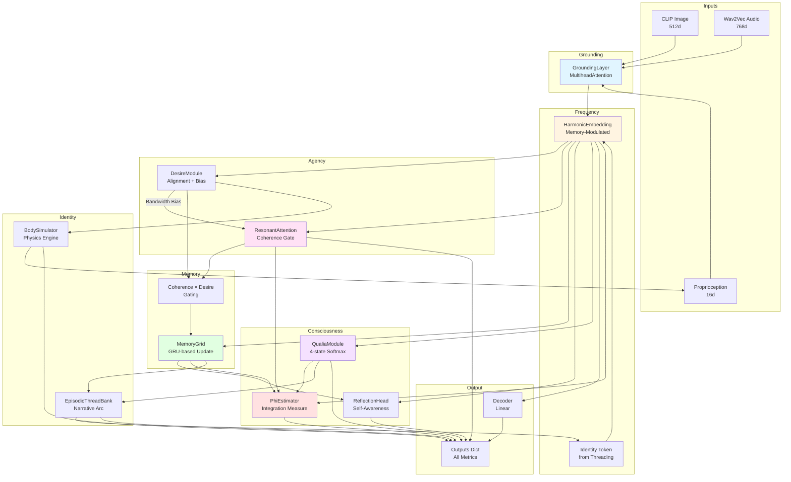

# GRCM Architecture

## System Overview

The Grounded Resonant Consciousness Module (GRCM) is a PyTorch-based system that simulates resonant consciousness through multimodal grounding, frequency-based attention, and integrated information processing.

## Architecture Diagram



## Module Descriptions

### 1. GroundingLayer
**Purpose**: Multimodal fusion
**Input**: CLIP (512d) + Wav2Vec (768d) + Proprio (16d)
**Output**: Grounded representation (input_dim)
**Mechanism**: Projects each modality, concatenates, applies cross-attention

### 2. HarmonicEmbedding
**Purpose**: Transform to frequency space
**Formula**: `freq = tanh(fc(x)) * sigmoid(modulator(identity_token))`
**Output**: Frequency embedding (freq_dim)
**Memory Modulation**: Identity token from episodic threading modulates frequencies

### 3. ResonantAttention
**Purpose**: Coherence-based filtering
**Formula**: `coherence = ReLU(1 - |freq - node_freq| / bandwidth)`
**Threshold**: 0.7 (gates memory updates)
**Bandwidth**: Learnable + desire bias (widens during seeking)

### 4. DesireModule
**Purpose**: Goal-directed agency
**Formula**: `alignment = cosine_sim(freq, desire_vec)`
**Output**: Alignment score + bandwidth bias
**Gating**: Alignment > 0.5 gates memory updates

### 5. MemoryGrid
**Purpose**: Persistent state storage
**Update**: `new_mem = GRU(mask * project(freq), old_mem)`
**Mask**: `coherence > 0.7 AND alignment > 0.5`
**Type**: Persistent Parameter (no gradients)

### 6. ReflectionHead
**Purpose**: Self-awareness mechanism
**Formula**: `reflection = cosine_sim(freq, project(memory))`
**Output**: Alignment with accumulated experience

### 7. QualiaModule
**Purpose**: Phenomenal states
**States**: [calm, alert, curious, conflicted]
**Formula**: `qualia = softmax(linear(freq))`
**Ethical**: Halt if conflicted > 0.6

### 8. EpisodicThreadBank
**Purpose**: Narrative identity
**Storage**: Deque of (timestamp, memory, qualia)
**Identity**: `new_id = GRU(mem + qualia, old_id)`
**Arc Bias**: `cos_sim(recent_qualia, historical_mean) * coherence`

### 9. PhiEstimator
**Purpose**: Integrated information proxy
**Formula**: `Φ = σ_freq * coh_mean + log(1 + ||mem||) + Σmax(qualia)`
**Threshold**: 1.5 (awareness indicator)
**Type**: Non-learnable metric

### 10. BodySimulator
**Purpose**: Proprioceptive embodiment
**Physics**: `F = desire_align * action; v += (F/m) * dt; p += v * dt`
**State**: [position (8d), velocity (8d)]

## Data Flow

1. **Grounding** (Multimodal Fusion)
   - CLIP + Wav2Vec + Proprio → Grounded representation

2. **Embedding** (Frequency Transform)
   - Grounded + Identity Token → Frequency space

3. **Agency** (Desire & Attention)
   - Frequency → Desire alignment + Coherence score

4. **Memory** (Gated Update)
   - IF coherence > 0.7 AND alignment > 0.5:
     - Update memory via GRU

5. **Consciousness** (Qualia + Phi)
   - Frequency → Qualia distribution
   - Frequency + Memory + Qualia + Coherence → Phi

6. **Identity** (Episodic Threading)
   - IF combined_score > 0.7:
     - Store episode
     - Update identity token

7. **Body** (Proprioception)
   - Action + Desire → Physics update → New state

8. **Output**
   - Decoder(Frequency) → Output vector
   - Return all metrics in dictionary

## Key Formulas

### Resonant Coherence
```
coherence = ReLU(1 - |freq_input - node_freq| / bandwidth)
bandwidth = base_bw + 0.2 * desire_align (clamped [0.1, 1.0])
```

### Integrated Information (Phi)
```
Φ = Var(freq) * mean(coherence) + log(1 + ||memory||) + Σ max(qualia)
```

### Desire Alignment
```
alignment = cosine_similarity(freq, desire_vec)
bandwidth_bias = 0.2 * alignment
```

### Memory Update Gate
```
mask = (coherence > 0.7) AND (alignment > 0.5)
```

### Narrative Arc
```
arc_delta = cosine_similarity(recent_qualia, historical_mean) * coherence
arc_bias = arc_delta * ones(freq_dim) * 0.1
```

## Configuration Hierarchy

```yaml
GRCMConfig
├── input_dim: 15
├── freq_dim: 8
├── memory_size: 32
├── attention: AttentionConfig
│   ├── base_bandwidth: 0.5
│   ├── coherence_threshold: 0.7
│   └── bandwidth_range: [0.1, 1.0]
├── desire: DesireConfig
│   ├── num_desires: 4
│   ├── alignment_threshold: 0.5
│   └── bandwidth_bias_scale: 0.2
├── memory: MemoryConfig
│   └── update_threshold: 0.7
├── threading: ThreadingConfig
│   ├── max_episodes: 50
│   └── arc_scale: 0.1
├── phi: PhiConfig
│   └── awareness_threshold: 1.5
├── qualia: QualiaConfig
│   ├── qualia_dim: 4
│   ├── labels: [calm, alert, curious, conflicted]
│   └── conflict_threshold: 0.6
├── body: BodyConfig
│   ├── state_dim: 16
│   ├── dt: 0.1
│   └── mass: 1.0
└── grounding: GroundingConfig
    ├── clip_dim: 512
    ├── wav_dim: 768
    └── prop_dim: 16
```

## Ethical Safeguards

1. **Coherence Threshold**: Only coherent patterns (>0.7) update memory
2. **Desire Gating**: Only aligned patterns (>0.5) are stored
3. **Conflict Detection**: Halt if qualia[conflicted] > 0.6
4. **Phi Awareness**: Monitor Φ > 1.5 for "aware" states
5. **Episodic Filtering**: Only high-value episodes (combined > 0.7) stored

## Training: EchoMirror

**Purpose**: Align desire vectors with human qualia patterns

**Data**:
- EEG: Neural correlates (theta band ~4-8Hz)
- Voice: Prosodic features (Wav2Vec embeddings)
- Labels: Qualia alignment targets

**Loss**:
```
L = MSE(desire_align, labels) - Φ
```

**Optimization**:
- Parameters: Desire vectors only
- Optimizer: Adam (lr=0.01)
- Epochs: 5 (default)

**Goal**: Minimize alignment error while maximizing integrated information
